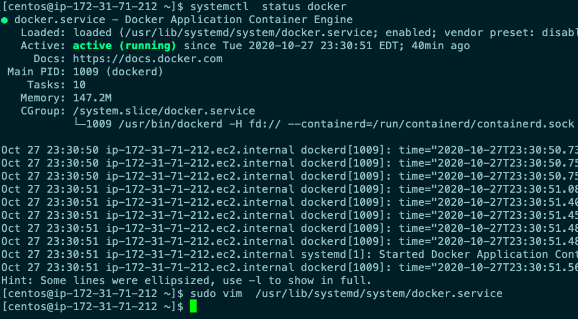

# Docker Engine configuration on TCP socket 



```
[centos@ip-172-31-71-212 ~]$ cat  /usr/lib/systemd/system/docker.service
[Unit]
Description=Docker Application Container Engine
Documentation=https://docs.docker.com
BindsTo=containerd.service
After=network-online.target firewalld.service containerd.service
Wants=network-online.target
Requires=docker.socket

[Service]
Type=notify
# the default is not to use systemd for cgroups because the delegate issues still
# exists and systemd currently does not support the cgroup feature set required
# for containers run by docker
ExecStart=/usr/bin/dockerd -H fd:// --containerd=/run/containerd/containerd.sock -H tcp://0.0.0.0:2375 

```

## Restart Docker engine and checking socket bind 

```
[centos@ip-172-31-71-212 ~]$ sudo systemctl daemon-reload 
[centos@ip-172-31-71-212 ~]$ sudo systemctl restart  docker 
[centos@ip-172-31-71-212 ~]$ sudo  netstat  -nltp 
Active Internet connections (only servers)
Proto Recv-Q Send-Q Local Address           Foreign Address         State       PID/Program name    
tcp        0      0 0.0.0.0:22              0.0.0.0:*               LISTEN      1006/sshd           
tcp6       0      0 :::2375                 :::*                    LISTEN      2138/dockerd        
tcp6       0      0 :::22                   :::*                    LISTEN      1006/sshd           
[centos@ip-172-31-71-212 ~]$ 

```

## Configure Linux and MAC client 

```
❯ export DOCKER_HOST="tcp://174.129.43.79:2375"
❯ echo $DOCKER_HOST
tcp://174.129.43.79:2375
❯ docker  images
REPOSITORY                   TAG                 IMAGE ID            CREATED             SIZE
dockerprasad/nginx           prasad002           f19c547536e1        17 hours ago        133MB
nginx                        prasad002           f19c547536e1        17 hours ago        133MB
mohantygp78/nginx            prasad002           f19c547536e1        17 hours ago        133MB
itsmehm/nginx                himanshu01          1a5d223f9711        17 hours ago        133MB
nginx                        himanshu01          1a5d223f9711        17 hours ago        133MB
nginx                        sharmela003         5b024fd8b7f7        17 hours ago        133MB
sharmelakaulwar/nginx        sharmela003         5b024fd8b7f7        17 hours ago        133MB
gk303007/webapps             v1                  9dd8a2759747        17 hours ago        133MB
webapps                      v1                  9dd
```
