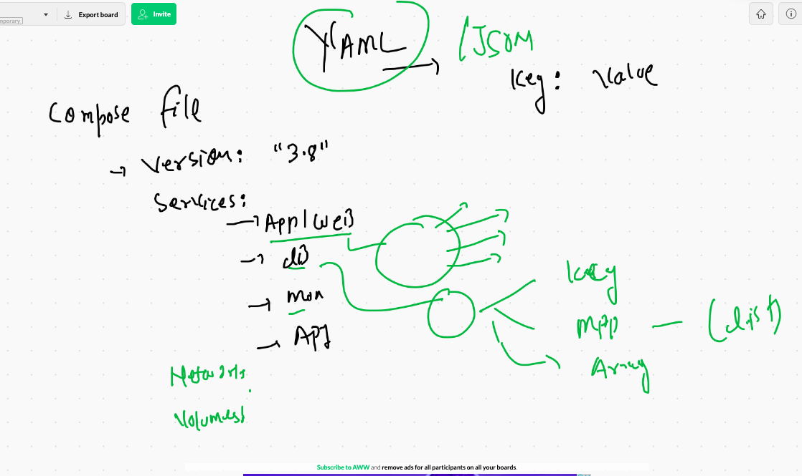
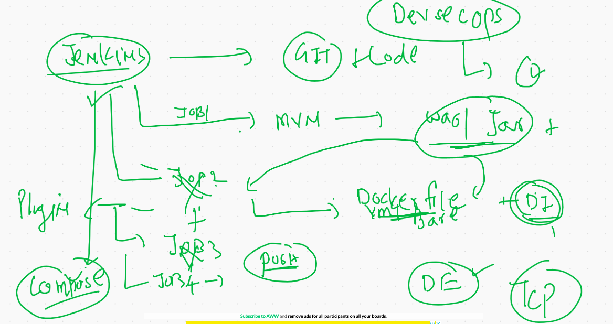
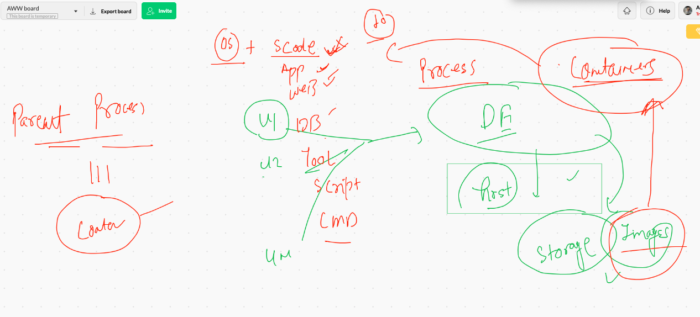
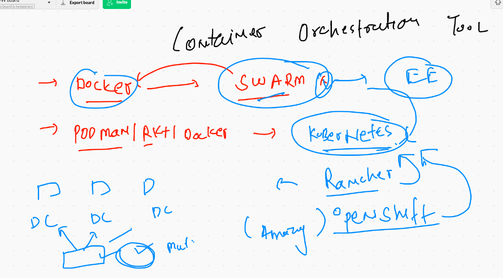
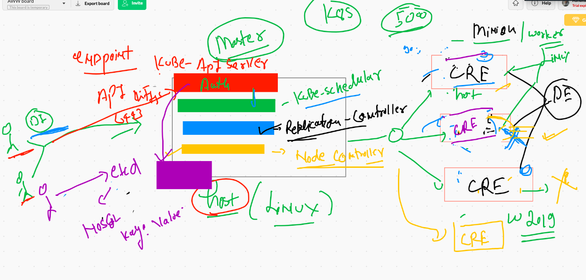
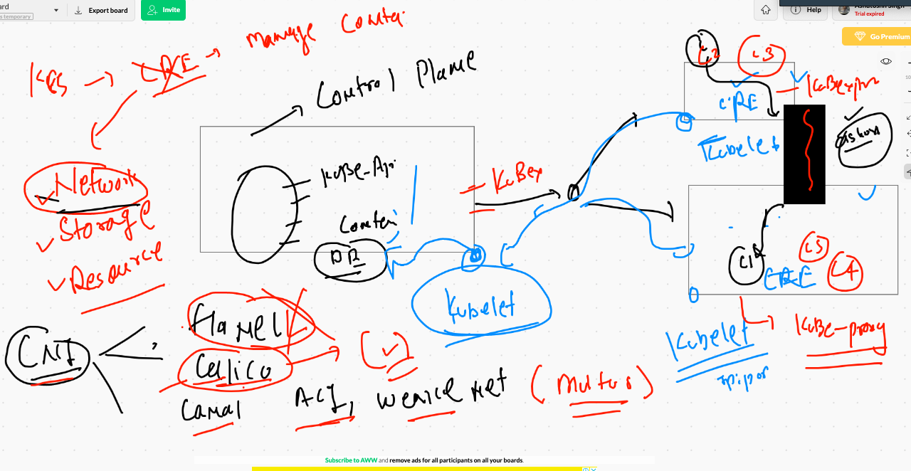
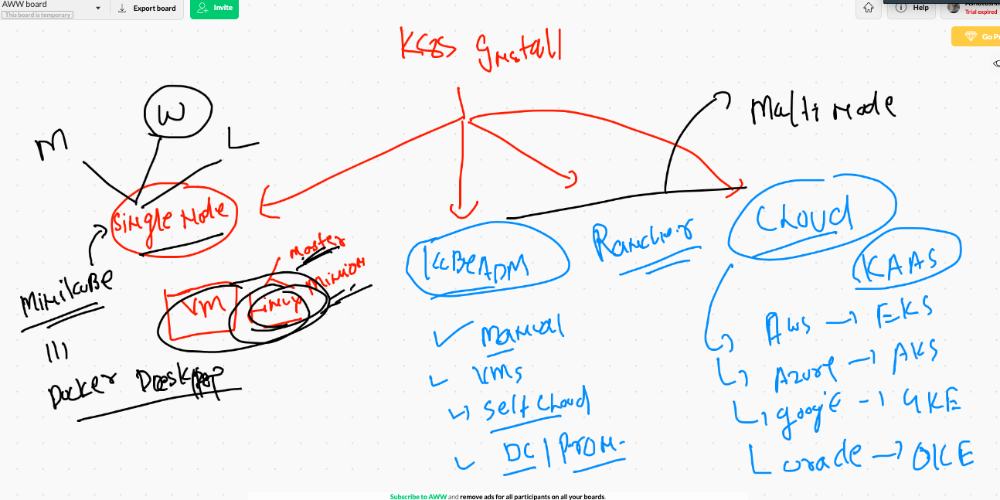
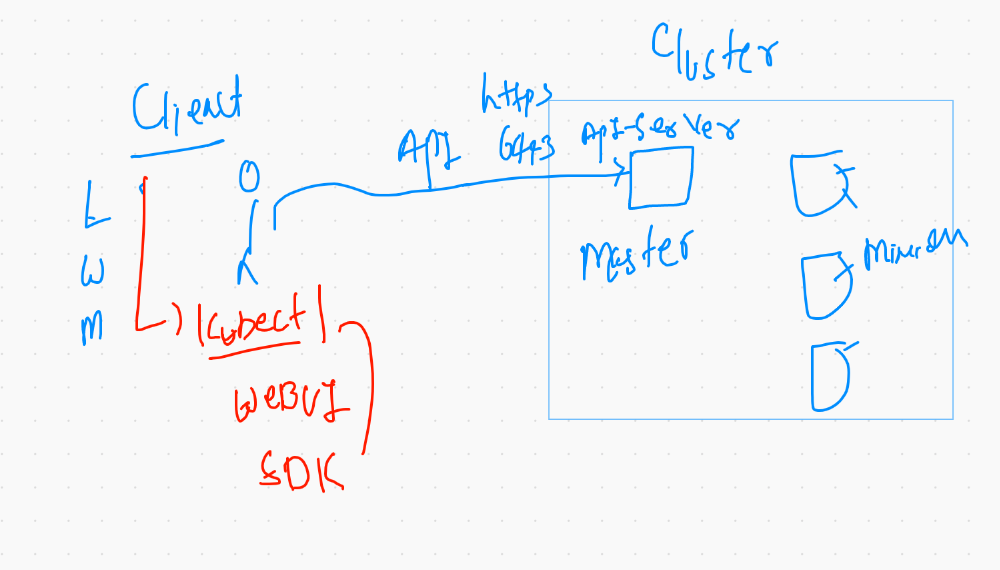
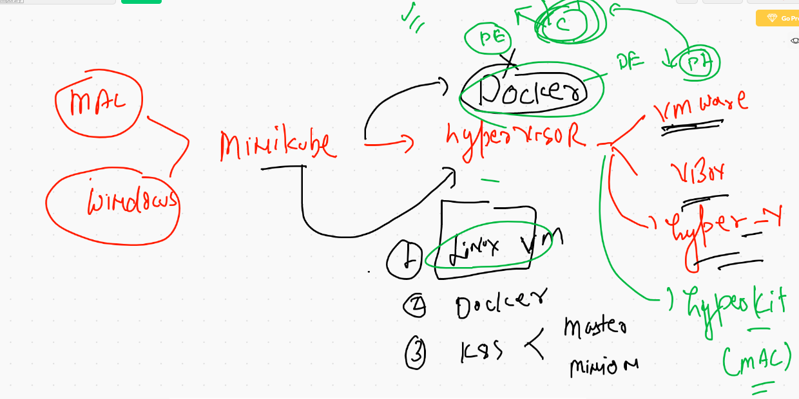
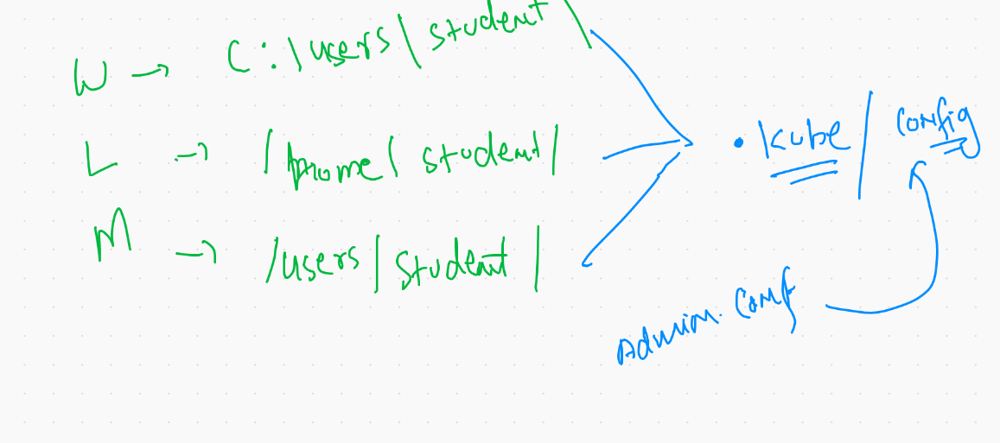

# Docker Compose 

## Installation of docker compose on linux client 

```
779  sudo curl -L "https://github.com/docker/compose/releases/download/1.27.4/docker-compose-$(uname -s)-$(uname -m)" -o /usr/local/bin/docker-compose
  780  sudo chmod +x /usr/local/bin/docker-compose
  781  sudo ln -s /usr/local/bin/docker-compose /usr/bin/docker-compose
  782  docker-compose  -v

```

## link for installation docker compose 

[link compose] ('https://docs.docker.com/compose/install/')

## COmpose file version 

[file version link] ('https://docs.docker.com/compose/compose-file/')

## Compose file overview 



## Docker compose file example 1 :

```
[centos@ip-172-31-71-212 myashuapp1]$ cat docker-compose.yml 
version: "3.8"  
services:
 appweb:
  image: nginx
  container_name: ashuc11
  restart: always
  ports:
   - "1122:80"

# docker run --name ashuc11 --restart always -p 1122:80 nginx

```
## Docker compose commands

```
798  docker-compose up -d
  799  docker-compose ps
  800  cat docker-compose.yml 
  801  history 
  802  docker-compose ps
  803  ls
  804  clear
  805  docker-compose ps
  806  docker-compose 
  807  history 
  808  docker-compose  ps
  809  docker-compose  stop 
  810  docker-compose  ps
  811  docker-compose  start
  812  docker-compose  ps
  813  docker-compose  kill
  814  docker-compose  ps
  815  docker-compose  start
  816  docker-compose  kill
  
  ```
  
## Most easier way 

```
[centos@ip-172-31-71-212 myashuapp1]$ docker-compose up -d
Creating network "myashuapp1_default" with the default driver
Creating ashuc11 ... done
[centos@ip-172-31-71-212 myashuapp1]$ docker-compose down
Stopping ashuc11 ... done
Removing ashuc11 ... done
Removing network myashuapp1_default

```

## Jenkins job for CI CD



## compose file example 2

```
[centos@ip-172-31-71-212 myashuapp1]$ cat docker-compose.yml 
version: "3.8"  
services:
 testapp:
  image: alpine
  container_name: ashuccx33
  command: ping fb.com
  restart: always 

 appweb:
  image: nginx
  container_name: ashuc11
  restart: always
  ports:
   - "1122:80"


```

## Docker compose more Examples 

[ashutoshh repo] ('https://github.com/redashu/docker-compose')


## COntainer management problems



## container orchestration solutions 



## Kubernetes architecture



## kubernetes minion nodes



## k8s installation method



## k8s client to k8s cluster connection 



## Installing minikube on Mac OS 

```
695  curl -LO https://storage.googleapis.com/minikube/releases/latest/minikube-darwin-amd64
 
  697  sudo install minikube-darwin-amd64 /usr/local/bin/minikube
  698  minikube version
```

## Minikube to install k8s single node cluster 



## checking kubectl connectin 

```
❯ kubectl version
Client Version: version.Info{Major:"1", Minor:"19", GitVersion:"v1.19.3", GitCommit:"1e11e4a2108024935ecfcb2912226cedeafd99df", GitTreeState:"clean", BuildDate:"2020-10-14T12:50:19Z", GoVersion:"go1.15.2", Compiler:"gc", Platform:"darwin/amd64"}
Server Version: version.Info{Major:"1", Minor:"19", GitVersion:"v1.19.2", GitCommit:"f5743093fd1c663cb0cbc89748f730662345d44d", GitTreeState:"clean", BuildDate:"2020-09-16T13:32:58Z", GoVersion:"go1.15", Compiler:"gc", Platform:"linux/amd64"}
❯ 
❯ 
❯ kubectl  get  nodes
NAME       STATUS   ROLES    AGE   VERSION
minikube   Ready    master   28m   v1.19.2


```

## Remove cluster 

```
❯ kubectl  version  --kubeconfig  admin.conf
Client Version: version.Info{Major:"1", Minor:"19", GitVersion:"v1.19.3", GitCommit:"1e11e4a2108024935ecfcb2912226cedeafd99df", GitTreeState:"clean", BuildDate:"2020-10-14T12:50:19Z", GoVersion:"go1.15.2", Compiler:"gc", Platform:"darwin/amd64"}
Server Version: version.Info{Major:"1", Minor:"19", GitVersion:"v1.19.3", GitCommit:"1e11e4a2108024935ecfcb2912226cedeafd99df", GitTreeState:"clean", BuildDate:"2020-10-14T12:41:49Z", GoVersion:"go1.15.2", Compiler:"gc", Platform:"linux/amd64"}
❯ 
❯ kubectl  get  nodes  --kubeconfig  admin.conf
NAME                            STATUS   ROLES    AGE     VERSION
ip-172-31-37-175.ec2.internal   Ready    <none>   7h21m   v1.19.3
ip-172-31-44-72.ec2.internal    Ready    <none>   7h21m   v1.19.3
ip-172-31-47-137.ec2.internal   Ready    master   7h21m   v1.19.3

```

## admin.conf setup 



