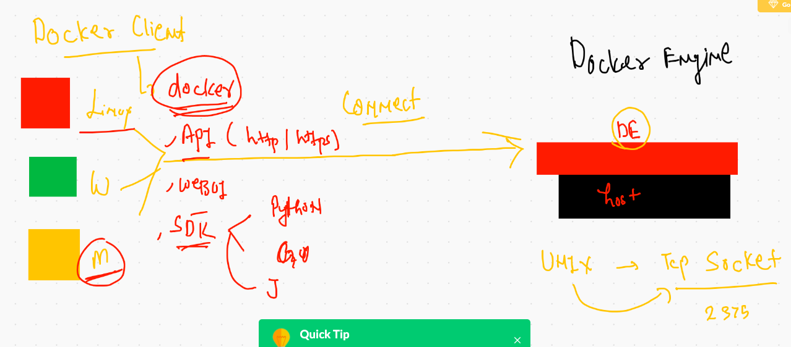
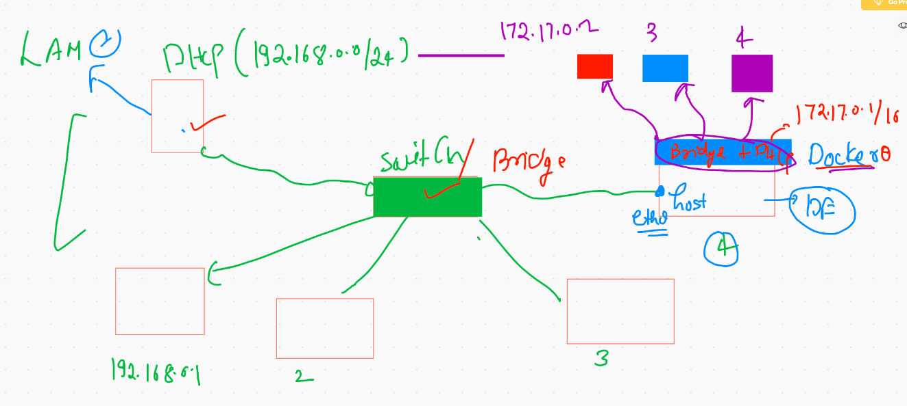
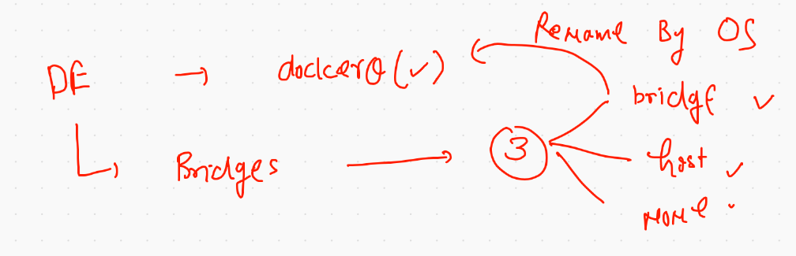
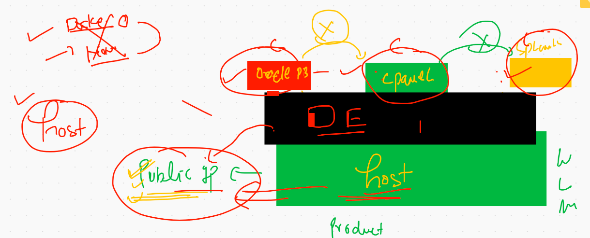

# Docker Engine configuration on TCP socket 


```
[centos@ip-172-31-71-212 ~]$ cat  /usr/lib/systemd/system/docker.service
[Unit]
Description=Docker Application Container Engine
Documentation=https://docs.docker.com
BindsTo=containerd.service
After=network-online.target firewalld.service containerd.service
Wants=network-online.target
Requires=docker.socket

[Service]
Type=notify
# the default is not to use systemd for cgroups because the delegate issues still
# exists and systemd currently does not support the cgroup feature set required
# for containers run by docker
ExecStart=/usr/bin/dockerd -H fd:// --containerd=/run/containerd/containerd.sock -H tcp://0.0.0.0:2375 

```

## Restart Docker engine and checking socket bind 

```
[centos@ip-172-31-71-212 ~]$ sudo systemctl daemon-reload 
[centos@ip-172-31-71-212 ~]$ sudo systemctl restart  docker 
[centos@ip-172-31-71-212 ~]$ sudo  netstat  -nltp 
Active Internet connections (only servers)
Proto Recv-Q Send-Q Local Address           Foreign Address         State       PID/Program name    
tcp        0      0 0.0.0.0:22              0.0.0.0:*               LISTEN      1006/sshd           
tcp6       0      0 :::2375                 :::*                    LISTEN      2138/dockerd        
tcp6       0      0 :::22                   :::*                    LISTEN      1006/sshd           
[centos@ip-172-31-71-212 ~]$ 

```

## Configure Linux and MAC client 

```
❯ export DOCKER_HOST="tcp://174.129.43.79:2375"
❯ echo $DOCKER_HOST
tcp://174.129.43.79:2375
❯ docker  images
REPOSITORY                   TAG                 IMAGE ID            CREATED             SIZE
dockerprasad/nginx           prasad002           f19c547536e1        17 hours ago        133MB
nginx                        prasad002           f19c547536e1        17 hours ago        133MB
mohantygp78/nginx            prasad002           f19c547536e1        17 hours ago        133MB
itsmehm/nginx                himanshu01          1a5d223f9711        17 hours ago        133MB
nginx                        himanshu01          1a5d223f9711        17 hours ago        133MB
nginx                        sharmela003         5b024fd8b7f7        17 hours ago        133MB
sharmelakaulwar/nginx        sharmela003         5b024fd8b7f7        17 hours ago        133MB
gk303007/webapps             v1                  9dd8a2759747        17 hours ago        133MB
webapps                      v1                  9dd
```

## Visual of Docker client 



## Resource limit using cgroups in docker / container 

```
docker run -d  --name ashuc1restrict  --memory 100M     alpine ping fb.com 
```

## updating resource in an existing container 

```
docker update  ashuc1  --memory 50M 
```

## updating cpu info 

```
docker  run -d --name ashuxc2  --cpus=1  alpine ping fb.com
docker  run -d --name ashuxc3  --cpuset-cpus=0  --cpu-shares=20  alpine ping fb.com
```

# Dockerfile More Examples 

## code

```
[centos@ip-172-31-71-212 myjavacode]$ cat  hello.java 
class myclass { 
    public static void main(String args[]) 
    { 
        // test expression 
               while (true) { 
                            System.out.println("Hello World"); 
        //                       
        //                                   // update expression 
                             } 
            } 
          } 

```

## Dockerfile

```
[centos@ip-172-31-71-212 myjavacode]$ cat  Dockerfile 
FROM java
MAINTAINER  ashutoshh
RUN  mkdir  /codes
COPY  hello.java  /codes/hello.java
WORKDIR  /codes
RUN  javac  hello.java
CMD  ["java","myclass"]

```

## Now build java image

```
[centos@ip-172-31-71-212 myjavacode]$ docker  build -t  java:ashuappv1 .  
Sending build context to Docker daemon  3.072kB
Step 1/7 : FROM java
 ---> d23bdf5b1b1b
Step 2/7 : MAINTAINER  ashutoshh
 ---> Running in 14a22004db2f
Removing intermediate container 14a22004db2f
 ---> ecd2f7064295
Step 3/7 : RUN  mkdir  /codes
 ---> Running in 93159b4b8756
Removing intermediate container 93159b4b8756
 ---> 29607a2b2f42
Step 4/7 : COPY  hello.java  /codes/hello.java
 ---> 43249a2c6790
Step 5/7 : WORKDIR  /codes
 ---> Running in 5a96fbe4a9
 ```
 
 
 ## Now creating container from Docker image 
 
 ```
  docker  run -itd --name ashujc111  java:ashuappv1  
  
```

## checking logs 

```
docker logs  ashujc111 

```

## Dockerfile with Entrypoint parent process

```
[centos@ip-172-31-71-212 myjavacode]$ cat Dockerfile 
FROM java
MAINTAINER  ashutoshh
RUN  mkdir  /codes
COPY  hello.java  /codes/hello.java
WORKDIR  /codes
RUN  javac  hello.java
#CMD  ["java","myclass"]
ENTRYPOINT  ["java","myclass"]
# cmd based parent process can be over write during container build time
#  as  the last argument of  container creation from docker image 
[centos@ip-172-31-71-212 myjavacode]$ docker build  -t  java:ashuappnewv111 . 

```

## Some info about web server


## Dockerfile WIth ARg 

```
FROM  centos 
MAINTAINER  ashutoshh@linux.com
ARG  soft=httpd
RUN yum  install  $soft git -y
WORKDIR  /tmp
RUN  git clone  https://github.com/mdn/beginner-html-site-styled
RUN  mv  beginner-html-site-styled/*    /var/www/html/
RUN  rm  -rf  beginner-html-site-styled
EXPOSE 80
# by default when container will be launched it will assume 80 port for that container 
#  EXpose is optional during container creation you can mention it 
ENTRYPOINT  systemctl start  httpd 

```

## Building commands

```
 527  docker  build  -t   oraclehttpd:ashuv00111  .
  528  history 
  529  cat  Dockerfile 
  530  docker  build   --build-arg soft=telnet  -t   oraclehttpd:ashuv00111  .
  ```
  
  
## creating container to access app from outside

```
docker run -d --name helloashu1 -p  2121:80 oraclehttp:ashuv001 
```

## Dockerfile with ARg and ENV

```
[centos@ip-172-31-71-212 apache-httpd]$ cat  Dockerfile 
FROM  centos 
MAINTAINER  ashutoshh@linux.com
ARG  soft=httpd
ENV  var1=$soft
# arg based variable value can be changed during image build time 
# but you don't have to change original dockerfile
#  this soft var will not be present in container 
RUN yum  install  $soft git -y
WORKDIR  /tmp
RUN  git clone  https://github.com/mdn/beginner-html-site-styled
RUN  mv  beginner-html-site-styled/*    /var/www/html/
RUN  rm  -rf  beginner-html-site-styled
EXPOSE 80
# by default when container will be launched it will assume 80 port for that container 
#  EXpose is optional during container creation you can mention it 
ENTRYPOINT /usr/sbin/httpd -DFOREGROUND

```

# Docker Network 



## check no of bridges by Docker engine 



## few more commands 

```
[centos@ip-172-31-71-212 ~]$ docker  network  ls
NETWORK ID          NAME                DRIVER              SCOPE
9268cc2404c1        bridge              bridge              local
9152d3a0ea6b        host                host                local
c194b17a689b        none                null                local

```

====

```
  642  docker  network  inspect  9268cc2404c1  
  643  history 
[centos@ip-172-31-71-212 ~]$ docker  network  inspect  9268cc2404c1   |   grep -i ip
        "EnableIPv6": false,
        "IPAM": {
                "IPv4Address": "172.17.0.5/16",
                "IPv6Address": ""
                "IPv4Address": "172.17.0.4/16",
                "IPv6Address": ""
                "IPv4Address": "172.17.0.3/16",
                "IPv6Address": ""
                "IPv4Address": "172.17.0.9/16",
                "IPv6Address": ""
                "IPv4Address": "172.17.0.7/16",
                
```

## Container with None Bridge

```
[centos@ip-172-31-71-212 ~]$ docker run  -it  --rm  --network  none  alpine  sh 
/ # ifconfig 
lo        Link encap:Local Loopback  
          inet addr:127.0.0.1  Mask:255.0.0.0
          UP LOOPBACK RUNNING  MTU:65536  Metric:1
          RX packets:0 errors:0 dropped:0 overruns:0 frame:0
          TX packets:0 errors:0 dropped:0 overruns:0 carrier:0
          collisions:0 txqueuelen:1000 
          RX bytes:0 (0.0 B)  TX bytes:0 (0.0 B)

/ # ping 172.17.0.1
PING 172.17.0.1 (172.17.0.1): 56 data bytes
ping: sendto: Network unreachable

```

## Docker Host Bridge



```
[centos@ip-172-31-71-212 ~]$ docker run  -it --rm  --network host alpine  sh 
/ # ifconfig 
docker0   Link encap:Ethernet  HWaddr 02:42:F4:1F:BD:7D  
          inet addr:172.17.0.1  Bcast:172.17.255.255  Mask:255.255.0.0
          inet6 addr: fe80::42:f4ff:fe1f:bd7d/64 Scope:Link
          UP BROADCAST MULTICAST  MTU:1500  Metric:1
          RX packets:159752 errors:0 dropped:0 overruns:0 frame:0
          TX packets:212630 errors:0 dropped:0 overruns:0 carrier:0
          collisions:0 txqueuelen:0 
          RX bytes:12494086 (11.9 MiB)  TX bytes:1053380062 (1004.5 MiB)

eth0      Link encap:Ethernet  HWaddr 16:88:8D:25:16:C9  
          inet addr:172.31.71.212  Bcast:172.31.79.255  Mask:255.255.240.0
          inet6 addr: fe80::1488:8dff:fe25:16c9/64 Scope:Link
          UP BROADCAST RUNNING MULTICAST  MTU:9001  Metric:1
          RX packets:1438360 errors:0 dropped:0 overruns:0 frame:0
          TX packets:334315 errors:0 dropped:0 overruns:0 carrier:0
          collisions:0 txqueuelen:1000 
          RX bytes:1844140673 (1.7 GiB)  TX bytes:72555989 (69.1 MiB)


```

## Custom Bridge

```
[centos@ip-172-31-71-212 ~]$ docker  network  create  ashubr1  --subnet  192.168.1.0/24 
979238f7c6e4ad199555c7c1bdfc83ae5e0c1cb513a397654c5fce12c8ab0ea4
[centos@ip-172-31-71-212 ~]$ docker  network  ls
NETWORK ID          NAME                DRIVER              SCOPE
979238f7c6e4        ashubr1             bridge              local
9268cc2404c1        bridge              bridge              local
9152d3a0ea6b        host                host                local
c194b17a689b        none                null                local

```
