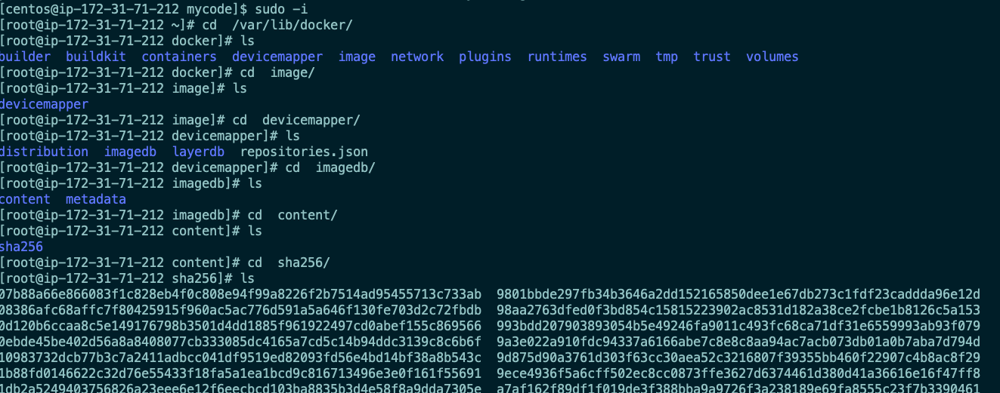
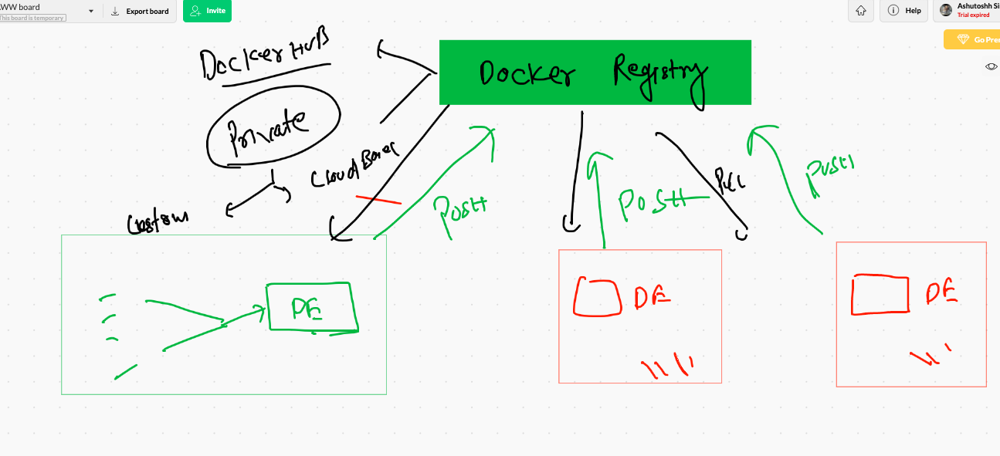
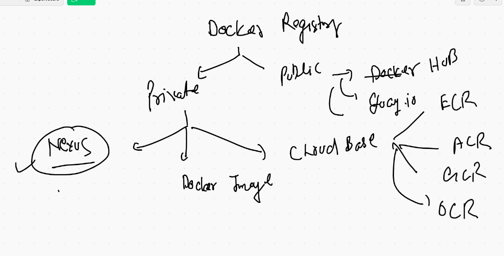

# Docker & K8s 

## web server 


## VM vs containers


## Container run time Engines 


## Docker installation history 


## Docker desktop link for Mac OS 

[docker desktop] ('https://hub.docker.com/editions/community/docker-ce-desktop-mac')

## Docker Desktop for Windows 10 

[docker desktop] ('https://hub.docker.com/editions/community/docker-ce-desktop-windows/')


## Docker Community Edition installation on Centos / OL 

```
sudo yum-config-manager \
    --add-repo \
    https://download.docker.com/linux/centos/docker-ce.repo
====

sudo yum install docker-ce docker-ce-cli containerd.io

```

## Starting Docker in LInux Distribution 

```
   18  sudo systemctl start  docker 
   19  sudo systemctl status   docker 
   20  history 
[centos@ip-172-31-71-212 ~]$ sudo  docker  version  
Client: Docker Engine - Community
 Version:           19.03.13
 API version:       1.40
 Go version:        go1.13.15
 Git commit:        4484c46d9d
 Built:             Wed Sep 16 17:03:45 2020
 OS/Arch:           linux/amd64
 Experimental:      false

Server: Docker Engine - Community
 Engine:
  Version:          19.03.13
  API version:      1.40 (minimum version 1.12)
  Go version:       go1.13.15
  Git commit:       4484c46d9d
  Built:            Wed Sep 16 17:02:21 2020
  OS/Arch:          linux/amd64
  Experimental:     false
 containerd:
  Version:          1.3.7
  GitCommit:        8fba4e9a7d01810a393d5d25a3621dc101981175
 runc:
  Version:          1.0.0-rc10
  GitCommit:        dc9208a3303feef5b3839f4323d9beb36df0a9dd
 docker-init:
  Version:          0.18.0
  GitCommit:        fec3683

```

## To add a non root user to access Docker socket 

```
[centos@ip-172-31-71-212 ~]$ docker  version 
Client: Docker Engine - Community
 Version:           19.03.13
 API version:       1.40
 Go version:        go1.13.15
 Git commit:        4484c46d9d
 Built:             Wed Sep 16 17:03:45 2020
 OS/Arch:           linux/amd64
 Experimental:      false
Got permission denied while trying to connect to the Docker daemon socket at unix:///var/run/docker.sock: Get http://%2Fvar%2Frun%2Fdocker.sock/v1.40/version: dial unix /var/run/docker.sock: connect: permission denied
[centos@ip-172-31-71-212 ~]$ 
[centos@ip-172-31-71-212 ~]$ 
[centos@ip-172-31-71-212 ~]$ ls  -l  /var/run/docker.sock  
srw-rw---- 1 root docker 0 Oct 27 01:40 /var/run/docker.sock
[centos@ip-172-31-71-212 ~]$ 
[centos@ip-172-31-71-212 ~]$ sudo usermod -a -G docker  centos 
[centos@ip-172-31-71-212 ~]$ whoami
centos


```

# Docker Client to Docker Engine 

## Search 

```
 57  docker  search  java 
   58  docker  search  python 
   59  docker  search  mysql 
   60  history 
   61  docker  search  docker
   62  docker  search  dockerashu
   63  docker  search  ashutoshh
   64  history 
   65  docker  search  ashutoshh

```

## Pulling and check docker images

```
 73  docker  pull  java 
   74  docker  images
   75  docker  pull  python 
   76  docker  images
   77  docker  pull  python:3.6.12-alpine 
   78  history 
   79  docker  images
   80  docker  pull  alpine 
   81  docker  pull  centos 
   82  docker  images

```

## Container parent process


## Container create and check 

```
 98  docker  run   alpine  cal 12 2020  
   99  docker  run   alpine  ping google.com 
  100  docker  run -d    alpine  ping google.com 
  101  docker  ps
  102  docker  run -d  --name ashuc1  alpine  ping google.com 
  103  docker  ps
  104  history 
  105  docker  ps
  106  docker  ps -a
  107  history 
  108  docker  ps
  109  docker  run -d  --name ashuc1  alpine  ping fb.com
  110  docker  run -d  --name ashuc2  alpine  ping fb.com
  111  docker  ps
  112  history 
[centos@ip-172-31-71-212 ~]$ docker  ps
CONTAINER ID        IMAGE               COMMAND             CREATED              STATUS              PORTS               NAMES
1efbf8368968        alpine              "ping oracle.com"   11 seconds ago       Up 10 seconds                           pratest1
c43ed2f00c86        alpine              "ping oracle.com"   15 seconds ago       Up 14 seconds                           gk1
06610e2526c6        alpine              "ping fb.com"       29 seconds ago       Up 28 seconds                           ashuc2
aac082e8d9cf        alpine              "ping google.com"   37 seconds ago       Up 35 seconds                           sac1
eebd36fb17e1        alpine              "ping cisco.com"    40 seconds ago       Up 38 seconds                           mayur01
88be13ae6e7d        alpine              "ping google.com"   About a minute ago   Up About a minute                       namrathacontainer
cc38696c637e        alpine              "ping google.com"   2 minutes ago        Up 2 minutes                            ashuc1
2ac739403362        alpine              "ping google.com"   3 minutes ago        Up 3 minutes                            thirsty_bell

```

## check output of containrized parent process

```
  115  docker  logs  ashuc1 
  116  docker  logs  -f  ashuc1 
  
 ```
 
 ## stop containers 
 
 ```
  docker  stop  ashuc1 
   docker  stop  06610e2526c6  thirsty_bell 
   docker  kill    pratest1 
   
 ```

## child process in a running container 

```
[centos@ip-172-31-71-212 ~]$ docker  exec   -i -t   ashuc2   sh  
/ # 
/ # 
/ # 
/ # whoami
root
/ # cat  /etc/os-release 
NAME="Alpine Linux"
ID=alpine
VERSION_ID=3.12.1
PRETTY_NAME="Alpine Linux v3.12"
HOME_URL="https://alpinelinux.org/"
BUG_REPORT_URL="https://bugs.alpinelinux.org/"
/ # exit
[centos@ip-172-31-71-212 ~]$ docker  exec   -it   ashuc2   sh  
/ # 
/ # cat  /etc/os-release 
NAME="Alpine Linux"
ID=alpine
VERSION_ID=3.12.1
PRETTY_NAME="Alpine Linux v3.12"
HOME_URL="https://alpinelinux.org/"
BUG_REPORT_URL="https://bugs.alpinelinux.org/"

```


## check host kernel inside container 

```
[centos@ip-172-31-71-212 ~]$ docker  run  -it  --name ashux1  python  bash 
root@df4546a7fafd:/# 
root@df4546a7fafd:/# python
Python 3.9.0 (default, Oct 13 2020, 20:14:06) 
[GCC 8.3.0] on linux
Type "help", "copyright", "credits" or "license" for more information.
>>> exit;
Use exit() or Ctrl-D (i.e. EOF) to exit
>>> exit();
root@df4546a7fafd:/# whoami
root
root@df4546a7fafd:/# uname
Linux
root@df4546a7fafd:/# uname  -r
3.10.0-862.14.4.el7.x86_64
root@df4546a7fafd:/# cat  /etc/os-release 
PRETTY_NAME="Debian GNU/Linux 10 (buster)"
NAME="Debian GNU/Linux"
VERSION_ID="10"
VERSION="10 (buster)"
VERSION_CODENAME=buster
ID=debian
HOME_URL="https://www.debian.org/"
SUPPORT_URL="https://www.debian.org/support"
BUG_REPORT_URL="https://bugs.debian.org/"
root@df4546a7fafd:/# exit
[centos@ip-172-31-71-212 ~]$ cat  /etc/os-release 
NAME="CentOS Linux"
VERSION="7 (Core)"
ID="centos"
ID_LIKE="rhel fedora"
VERSION_ID="7"
PRETTY_NAME="CentOS Linux 7 (Core)"
ANSI_COLOR="0;31"
CPE_NAME="cpe:/o:centos:centos:7"
HOME_URL="https://www.centos.org/"
BUG_REPORT_URL="https://bugs.centos.org/"

CENTOS_MANTISBT_PROJECT="CentOS-7"
CENTOS_MANTISBT_PROJECT_VERSION="7"
REDHAT_SUPPORT_PRODUCT="centos"
REDHAT_SUPPORT_PRODUCT_VERSION="7"

[centos@ip-172-31-71-212 ~]$ uname -r
3.10.0-862.14.4.el7.x86_64


```

## all containers kill & Remove 

```
  53  docker  ps -q
   54  docker kill   $(docker  ps -q)
   
   58  docker rm  $(docker  ps -qa)
   59  docker  ps  -a

```

# Image building with Dockerfile 

```
centos@ip-172-31-71-212 mycode]$ pwd
/home/centos/mycode

[centos@ip-172-31-71-212 mycode]$ ls
Dockerfile  ashu.py

[centos@ip-172-31-71-212 mycode]$ docker  build  -t  python:ashuv001  .
Sending build context to Docker daemon  3.584kB
Step 1/7 : FROM  python
 ---> 5336a27a9b1f
Step 2/7 : MAINTAINER   ashutoshh@linux.com
 ---> Using cache
 ---> f05341251e45
Step 3/7 : RUN  mkdir  /myscript
 ---> Running in f99ce4c757ee
Removing intermediate container f99ce4c757ee
 ---> a9a1660a8026
Step 4/7 : COPY  ashu.py   /myscript/ashu.py
 ---> d8d81eaaf393
Step 5/7 : WORKDIR  /myscript
 ---> Running in e36afe7b8166
Removing intermediate container e36afe7b8166
 ---> b8eada3688ee
Step 6/7 : RUN chmod +x  ashu.py
 ---> Running in 34efd80f8b59
Removing intermediate container 34efd80f8b59
 ---> ee8c9c72c10e
Step 7/7 : CMD  ["python","ashu.py"]
 ---> Running in b0c684d067a0
Removing intermediate container b0c684d067a0
 ---> 3a743e9f3187
Successfully built 3a743e9f3187
Successfully tagged python:ashuv001

```

## When dockerfile name is different 

```
docker  build  -t  python:ashuv002  -f  dockerfile.python   . 

```

## docker image internal storage location 



## Resource monitoring 

```
  135  docker  stats  ashuc1  
```

## Enable your Docker daemon 

```
[centos@ip-172-31-71-212 ~]$ sudo systemctl  status  docker  
● docker.service - Docker Application Container Engine
   Loaded: loaded (/usr/lib/systemd/system/docker.service; disabled; vendor preset: disabled)
   Active: inactive (dead)
     Docs: https://docs.docker.com
[centos@ip-172-31-71-212 ~]$ 
[centos@ip-172-31-71-212 ~]$ 
[centos@ip-172-31-71-212 ~]$ sudo  systemctl  is-enabled  docker  
disabled
[centos@ip-172-31-71-212 ~]$ sudo  systemctl  enable  docker  
Created symlink from /etc/systemd/system/multi-user.target.wants/docker.service to /usr/lib/systemd/system/docker.service.
[centos@ip-172-31-71-212 ~]$ sudo  systemctl  is-enabled  docker  
enabled

```

## Restart policy in Containers

[restart policy] ('https://docs.docker.com/config/containers/start-containers-automatically/')


##  implementing restart policy in a new container 

```
docker  run -itd --name ashuc4 --restart  always  python:ashuv001
```

## change restart policy of an existing container 

```
docker  update   ashuc1 --restart always  
ashuc1
```

## Save Docker image as tar 

```
 docker  save  -o  ashupyapp.tar   python:ashuv001  
```

## load from tar 

```
docker  load  -i  ashupyapp.tar 

```

## Docker image registry concept 



## registry options 



## Pushing image on Docker hub 

```
376  docker  build  -t  nginx:ashuv001  . 
  377  cd
  378  docker  images
  379  history 
  380  docker  images
  381  docker  login 
  382  docker  tag   nginx:ashuv001    dockerashu/nginx:ashuv001
  383  docker  images
  384  docker  push   dockerashu/nginx:ashuv001
  385  history 
  386  docker  logout

```
