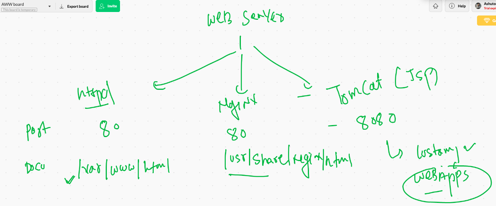

# Docker & K8s 

## web server 



## VM vs containers


## Container run time Engines 


## Docker installation history 


## Docker desktop link for Mac OS 

[docker desktop] ('https://hub.docker.com/editions/community/docker-ce-desktop-mac')

## Docker Desktop for Windows 10 

[docker desktop] ('https://hub.docker.com/editions/community/docker-ce-desktop-windows/')


## Docker Community Edition installation on Centos / OL 

```
sudo yum-config-manager \
    --add-repo \
    https://download.docker.com/linux/centos/docker-ce.repo
====

sudo yum install docker-ce docker-ce-cli containerd.io

```

